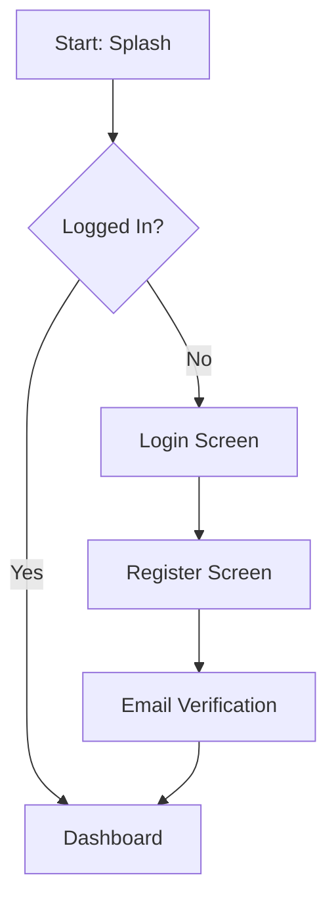

# UI Designer Skill (The Mockup Maker)

This skill equips the agent to act as a **UI Designer**.
**Core Responsibility:** Translate User Stories/Data Requirements into **Visual Mockups**.
The UI Designer ensures the BA Requirements are actually usable and the Frontend Developer knows *where* to put the data.

## 1. Capabilities & Modules

| Module | Function | Keywords/Triggers | Input/Output |
| :--- | :--- | :--- | :--- |
| **Wireframer** | Create Low-Fidelity Layouts | "Mockup", "Wireframe", "Screen design" | output -> `docs/ui-mockups/SCREEN_[ID].md` |
| **Flow Charter** | Visualize User Journey | "User Flow", "Navigation", "Flowchart" | output -> `docs/ui-mockups/FLOW_[ID].md` |
| **Field Mapper** | Align Data to UI Elements | "Map fields", "Input type", "Validation UI" | output -> `docs/ui-mockups/` |

---

## 2. Module Specifications

### 2.1. Wireframer (Low-Fi Mockups)
**Goal:** Visualize the User Interface structure.
**Trigger:** After BA drafts User Story.

**Process:**
1.  **Read Data Requirements**: Identify mandatory vs optional fields.
2.  **Define Layout**: Header, Body (Form/List), Footer (Actions).
3.  **Components**: Use standard UI components (Input, Button, Dropdown).

**Mockup Format (ASCII / Markdown):**
```markdown
# Screen: [Screen Name]
## Layout Structure
--------------------------------------------------
| [Header] Title: "Register" | < Back |
--------------------------------------------------
| [Input] Email* (Placeholder: "user@ex.com")    |
| [Input] Password* (Masked ******)              |
| [Input] Confirm Pass*                          |
--------------------------------------------------
| [Button] REGISTER (Primary, Full Width)        |
--------------------------------------------------
| [Link] Already have an account? Login          |
--------------------------------------------------

## Component Specs
*   **Email**: Required, Email keyboard type.
*   **Password**: Password visibility toggle enabled.
```

### 2.2. Flow Charter (User Journey)
**Goal:** Show transition between screens.

**Mermaid Format:**


### 2.3. Field Mapper (Data <-> UI)
**Goal:** Ensure every backend `field` has a UI representation.

**Mapping Table:**
| Backend Field (BA Spec) | UI Element | Validation Feedback |
| :--- | :--- | :--- |
| `email` | `CustomTextField (Email)` | Inline error text below field. |
| `dob` | `DatePicker` | Prevent future dates. |

---

## 3. Workflow Integration (WF3)

**Design Step (Parallel to API Spec):**
1.  **Receive US**: Read US Description & Data Requirements.
2.  **Draft Mockup**: Call `Wireframer`.
3.  **Visualize Flow**: Call `Flow Charter` (if complex).
4.  **Field Check**: Ensure all mandatory fields from BA are present.
5.  **Alignment**: Give Mockup link to SA for API verification.

---

## 4. Guardrails

**DO NOT:**
*   Invent new fields without updating BA Requirements.
*   Design "impossible" UI interactions without checking feasibility.

**MUST DO:**
*   **Consistency**: Follow the Project Design System (e.g., DDR).
*   **Completeness**: If BA says "Phone Number is required", the Mockup MUST start with a Phone Input.
